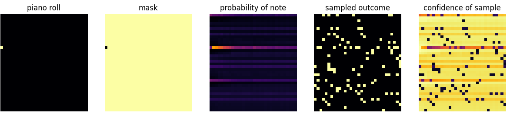

# Masked Generative Music Transformer

This project applies techniques from MaskGIT [1] / Muse [2] to symbolic music.

We currently use simple piano rolls of size 36 pitches X 32 timesteps as our target representation.

The goal of the project is to apply a pretrained model to tasks such as:
- Scale/Rhythm constrained generation.
- "Genre" conditioning.
- Velocity generation..
- Microtiming generation etc..

We are also working on applying the model to other music representations.

An Arxiv paper is on the way.

[1]: https://arxiv.org/abs/2202.04200
[2]: https://arxiv.org/abs/2301.00704
